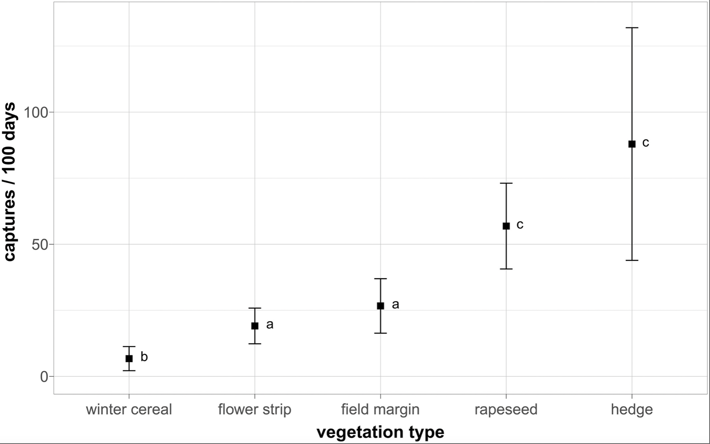
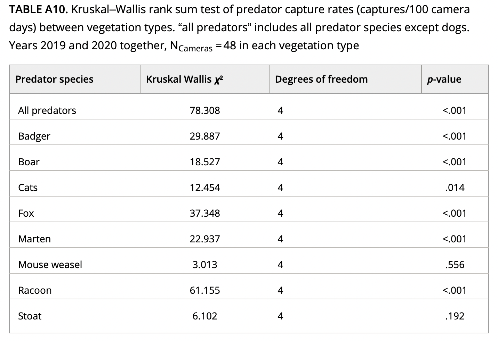

# Introduction

# Packages
Here is a list of packages I've downloaded for this replication project. 
```{r packages}
library(readr)
library(curl)
library(tidyverse)
library(dplyr)
library(ggpubr)
# these packages were mentioned within the paper for their statistical analysis 
library(stats)
library(ggplot2)
library(ggeffects)
library(FSA)
library(knitr)
```

# Data
This is the data provided from the paper. 
```{r uploading data}
# uploading the camera trap data from 2019 - 2020 for predator activity within the landscape analysis; what I mainly used for this project
f <- curl("https://raw.githubusercontent.com/amandafwu/Amandafw-data-replication-assignment/main/camera_trap_data_2019_2020.csv") 
camera_trap_data <- read.csv(f, header = TRUE, sep = ",")
head(camera_trap_data)

f <- curl("https://raw.githubusercontent.com/amandafwu/Amandafw-data-replication-assignment/main/camera_trap_data_flowerstrips_all.csv") # contains camera trap sites, positions (edge or center of the flower strip) and predator observations for each camera site sampled in flower strips
flowerstripsALL <- read.csv(f, header = TRUE, sep = ",")
head(flowerstripsALL)

f <- curl("https://raw.githubusercontent.com/amandafwu/Amandafw-data-replication-assignment/main/camera_trap_data_flowerstrips_1m.csv") # the same data as above ('camera_trap_data_flowerstrips_all.csv'), but at edge cameras, only predators that passed within 1 m of the camera were included
flowerstrips1m <- read.csv(f, header = TRUE, sep = ",")
head(flowerstrips1m)
```


# Descriptive Statistic
For my descriptive statistic, I will be replicating Table A7 which calculates the mean capture rates of all predators in each vegetation type. It also calculates the SD and 95% CI. 
```{r Descriptive Stat - pt 1}
# first, I calculated the summary stats with one column to see what I need to include in order to get the values. 
all_predators_wodogs <- group_by(camera_trap_data, Vegetation) %>% # grouping the Vegetation types and used piping for the following sections
  summarise(
    mean = mean(allpredators_without_dogs_100, na.rm = TRUE), # calculating mean
    sd = sd(allpredators_without_dogs_100, na.rm = TRUE), # calculating sd
    confint_lower = t.test(allpredators_without_dogs_100, na.rm = TRUE)$conf.int[1], #calculating the lower CI
    confint_upper = t.test(allpredators_without_dogs_100, na.rm = TRUE)$conf.int[2], #calculating the upper CI
    CI_width = ( confint_upper - confint_lower ) / 2 # typically, I would just subtract the upper with lower to get the CI value but this study seemed to have divided the CI values in half in the tables 
  )
all_predators_wodogs # matched the values from table A7 !
# then, I turned it into a function so I can get the summaries from each column more efficiently
summary_stats <- function(data, group, column) {
  results <- data %>% 
      group_by({{group}}) %>%
      summarise(
        mean = mean({{column}}, na.rm = TRUE),
        sd = sd({{column}}, na.rm = TRUE),
        confint_lower = t.test({{column}}, na.rm = TRUE)$conf.int[1],
        confint_upper = t.test({{column}}, na.rm = TRUE)$conf.int[2],
        CI_width = (confint_upper - confint_lower) / 2
      ) 
}
# this is repetitive but I'm entering all the predator columns into my function; there should be an easier way? 
badger_stats <- summary_stats(camera_trap_data, Vegetation, badger_100)
boar_stats <- summary_stats(camera_trap_data, Vegetation, boar_100)
cats_stats <- summary_stats(camera_trap_data, Vegetation, cats_100)
dog_stats <- summary_stats(camera_trap_data, Vegetation, dog_100)
fox_stats <- summary_stats(camera_trap_data, Vegetation, fox_100)
marten_stats <- summary_stats(camera_trap_data, Vegetation, marten_100)
mouseweasel_stats <- summary_stats(camera_trap_data, Vegetation, mouseweasel_100)
racoon_stats <- summary_stats(camera_trap_data, Vegetation, racoon_100) 
stoat_stats <- summary_stats(camera_trap_data, Vegetation, stoat_100)
# binding all the rows together 
table <- bind_rows(
  all_predators_wodogs,
  badger_stats,
  boar_stats,
  cats_stats,
  dog_stats,
  fox_stats,
  marten_stats,
  mouseweasel_stats,
  racoon_stats,
  stoat_stats
  )
table 
# ordering all the rows for each vegetation type together
ordered1 <- table[order(table$Vegetation), ]
ordered1
# adding a new column in the data set for the list of predators for each row
ordered1$predatorname <- c("All predators", "Badger","Boar","Cats","Dog","Fox","Marten","Mouse weasel","Racoon","Stoat","All predators", "Badger","Boar","Cats","Dog","Fox","Marten","Mouse weasel","Racoon","Stoat","All predators", "Badger","Boar","Cats","Dog","Fox","Marten","Mouse weasel","Racoon","Stoat","All predators", "Badger","Boar","Cats","Dog","Fox","Marten","Mouse weasel","Racoon","Stoat","All predators", "Badger","Boar","Cats","Dog","Fox","Marten","Mouse weasel","Racoon","Stoat")
ordered1
# changed the order of the columns by making "Vegetation" and "predatorname" to be the first two columns
table1 <- ordered1[, c("Vegetation", "predatorname", setdiff(names(ordered1), c("Vegetation", "predatorname")))]
table1
# renamed the letters for vegetation type by reassigning the letters to their name 
mapping <- c("B" = "Flower Strips",
             "E" = "Field Margins",
             "H" = "Hedge",
             "R" = "Rapeseed",
             "G" = "Winter Cereal")
table1$Vegetation <- mapping[table1$Vegetation] 
table1 # all the values match the table ! 
```

```{r Descriptive Stat - pt 2}
# to make the final part of the table with all vegetation types for each species, I removed group_by so it would take the mean, SD, and CI from the whole data set, ignoring vegetation type; basically the same function as before
summary_stats2 <- function(data, column) {
  results <- data %>%
      summarise(
        mean = mean({{column}}, na.rm = TRUE),
        sd = sd({{column}}, na.rm = TRUE),
        confint_lower = t.test({{column}}, na.rm = TRUE)$conf.int[1],
        confint_upper = t.test({{column}}, na.rm = TRUE)$conf.int[2],
        CI_width = (confint_upper - confint_lower) / 2
      ) 
}
#repetitive again
allpred_stat_all <- summary_stats2(camera_trap_data, allpredators_without_dogs_100)
badger_stat_all <- summary_stats2(camera_trap_data, badger_100)
boar_stat_all <- summary_stats2(camera_trap_data, boar_100)
cats_stat_all <- summary_stats2(camera_trap_data, cats_100)
dog_stat_all <- summary_stats2(camera_trap_data, dog_100)
fox_stat_all <- summary_stats2(camera_trap_data, fox_100)
marten_stat_all <- summary_stats2(camera_trap_data, marten_100)
mouseweasel_stat_all <- summary_stats2(camera_trap_data, mouseweasel_100)
racoon_stat_all <- summary_stats2(camera_trap_data, racoon_100)
stoat_stat_all <- summary_stats2(camera_trap_data, stoat_100)
# binding all the rows together again
allvegtype_table <- bind_rows(
  allpred_stat_all,
  badger_stat_all,
  boar_stat_all,
  cats_stat_all,
  dog_stat_all,
  fox_stat_all,
  marten_stat_all,
  mouseweasel_stat_all,
  racoon_stat_all,
  stoat_stat_all
  )
allvegtype_table
# adding the predator name column making sure it aligns with the functions I had entered above
allvegtype_table$predatorname <- c("All predators", "Badger","Boar","Cats","Dog","Fox","Marten","Mouse weasel","Racoon","Stoat") 
# also adding the column for vegetation so when we merge the data sets together, they'll have the same # of columns
allvegtype_table$Vegetation <- c("All vegetation types", "All vegetation types","All vegetation types","All vegetation types","All vegetation types","All vegetation types","All vegetation types","All vegetation types","All vegetation types","All vegetation types") 
# moving the predator name and vegetation column to the front
table2 <- allvegtype_table[, c("Vegetation", "predatorname", setdiff(names(allvegtype_table), c("Vegetation", "predatorname")))]
table2
# binding the two data sets together
completetable <- rbind(table1, table2)
completetable
# used a function to round all numerical values in the data set to three deciminals to match Table A7
round_df <- function(df, digits) {
  nums <- vapply(df, is.numeric, FUN.VALUE = logical(1))
  df[,nums] <- round(df[,nums], digits = digits)
  (df)
}
finaltable <- round_df(completetable, 3)
finaltable
# omitting the other columns that isn't in the final table
tableA7 <- finaltable[, !names(finaltable) %in% c("confint_lower","confint_upper")]
# using knitr to make it into a table for the html  
kable(tableA7) 
```


# Figure Replication
This is my replication of Figure 3 from the paper, showing mean capture rates of all predators in different vegetation types. Figure 3 is shown below which compared mean capture rate (captures/100days) of “all predators” in different vegetation types. 

```{r Figure 3}
# used ggplot to make the figure; used reorder with the mean to have the vegetation types reorder by increasing order; "allpredators_without_dogs_100" is the column showing the total number of independent predator captures, excluding dogs, extrapolated to 100 active camera days (according to the README)
p <- ggplot(camera_trap_data, aes(x=reorder(Vegetation, allpredators_without_dogs_100, FUN = mean), y=allpredators_without_dogs_100)) + 
  stat_summary(geom = "point", fun.y = mean, shape = 15, size = 2) + # makes it a scatter plot and played with the sizing and shape to look closest to the original figure
  ylab("captures/100 days") + # renaming y axis
  xlab("vegetation type") + # renaming x axis 
  stat_summary(fun.data = "mean_sdl", fun.args = list(mult = .3), geom = "errorbar", width = 0.15) + # added error bars and manipulated the multitude and width to best reflect the original figure; this might relate to how the CI intervals were also manipulated in the table ? 
  scale_x_discrete(labels = c("G" = "winter cereal", "B" = "flower strip", "E" = "field margin", "R" = "rapeseed", "H" = "hedge")) + # renaming the labels in Vegetation
  theme(axis.title = element_text(face = "bold")) # made the axis titles bold
p
```


# Inferential Statistic

Performing a Kruskal-Wallis rank sum test of predator capture rates within each vegetation type. A Kruskal-Wallis rank sum test is similar to a one-way ANOVA but for non-parametric data. 
```{r Kruskal-Wallis test}
kruskal.test(allpredators_without_dogs_100 ~ Vegetation, data = camera_trap_data)
kruskal.test(badger_100 ~ Vegetation, data = camera_trap_data)
kruskal.test(boar_100 ~ Vegetation, data = camera_trap_data)
kruskal.test(cats_100 ~ Vegetation, data = camera_trap_data)
kruskal.test(fox_100 ~ Vegetation, data = camera_trap_data)
kruskal.test(marten_100 ~ Vegetation, data = camera_trap_data)
kruskal.test(mouseweasel_100 ~ Vegetation, data = camera_trap_data)
kruskal.test(racoon_100 ~ Vegetation, data = camera_trap_data)
kruskal.test(stoat_100 ~ Vegetation, data = camera_trap_data)
```

To compare, here is the list of KW test results from the paper. The values seem to match exactly!


All of the p-values are also less than 0.05 so they are all significantly different. If a Kruskal-Wallis test is proven to be statistically different, then it is appropriate to conduct a Dunn's test to see exactly which predators are significant. 
```{r Dunn test}
badgerDT <- dunnTest(badger_100 ~ Vegetation, data = camera_trap_data, method="holm", list = TRUE)
badgerDT

mapping <- c("B - E" = "Flower Strips - Field Margins",
            "B - G" = "Flower Strips - Winter Cereal",
            "E - G" = "Field Margins - Winter Cereal",
            "B - H" = "Flower Strips - Hedge",
            "E - H" = "Field Margins - Hedge",
            "G - H" = "Winter Cereal - Hedge",
            "B - R" = "Flower Strips - Rapeseed",
            "E - R" = "Field Margins - Rapeseed",
            "G - R" = "Winter Cereal - Rapeseed",
            "H - R" = "Hedge - Rapeseed")


```


For my descriptive analysis, the paper stated that "our data were not normally distributed (Shapiro–Wilk Test, all p < .001, Table A1)," I calculated the Shapiro-Wilk test for each predator to compare the results to Table A1.  
```{r Table A1 junk}
# this is calculating the Shapiro Wilk test for all predators from 2019-2020 
animals <- as_tibble(camera_trap_data) 
predator <- animals %>% select(25:33,35)
results <- lapply(predator, shapiro.test)
results


shapiro.test(camera_trap_data$allpredators_without_dogs_100)
shapiro.test(camera_trap_data$badger_100)
shapiro.test(camera_trap_data$boar_100)
shapiro.test(camera_trap_data$cats_100)
shapiro.test(camera_trap_data$dog_100)
shapiro.test(camera_trap_data$fox_100)
shapiro.test(camera_trap_data$marten_100)
shapiro.test(camera_trap_data$mouseweasel_100)
shapiro.test(camera_trap_data$racoon_100)
shapiro.test(camera_trap_data$stoat_100)

my_data <- as_tibble(camera_trap_data)
predator <- my_data %>% select(25:33)
predator

colnames(predator)
names <- predator %>% 
  rename(
    Badger = badger_100,
    Boar = boar_100,
    Cat = cats_100,
    Dog = dog_100,
    Fox = fox_100,
    Marten = marten_100,
    MouseWeasel = mouseweasel_100,
    Racoon = racoon_100,
    Stoat = stoat_100
  )
colnames(names)
long <- names %>%
  gather(Predator, Captures)


p <- ggplot(long, aes(reorder(Predator, Captures), Captures)) +
  stat_summary(geom = "point", fun.y = mean) +
  ylab("captures/100 days") +
  xlab("Predator Species") +
  expand_limits(y = c(0,30)) 

p  

sd(predator$badger_100)
mean(predator$badger_100)


head(predator)
class(predator$badger_100)
class(long$Captures)
predator

```


## Sources: 
  + [replication paper](https://onlinelibrary.wiley.com/doi/full/10.1002/ece3.9027#ece39027-tbl-0107) 
  + [how to reorder the x-axis](https://stackoverflow.com/questions/3744178/ggplot2-sorting-a-plot)
  + [renaming columns](https://www.datanovia.com/en/lessons/rename-data-frame-columns-in-r/)
  + [plotting average values of certain columns in ggplot](https://stackoverflow.com/questions/58415083/plotting-average-values-from-multiple-columns-in-ggplot2)
  + [backup option](https://www.geeksforgeeks.org/plot-mean-and-standard-deviation-using-ggplot2-in-r/)
  + [dunn's test](https://www.statology.org/dunns-test-in-r/)
  + [rounding decimals](https://stackoverflow.com/questions/9063889/how-to-round-a-data-frame-in-r-that-contains-some-character-variables)
  + [KW test](https://www.reneshbedre.com/blog/kruskal-wallis-test.html)
  + [KW test](https://stackoverflow.com/questions/28813589/show-kruskal-wallis-test-ranks)
  + [dunn test package](https://cran.r-project.org/web/packages/dunn.test/dunn.test.pdf)
  + [dunn test table](https://stackoverflow.com/questions/28627603/how-to-create-a-table-as-dunn-test-output-r)
  + [ggplot](http://www.sthda.com/english/wiki/ggplot2-scatter-plots-quick-start-guide-r-software-and-data-visualization)
  + [error with $ operator](https://www.listendata.com/2022/05/r-error-operator-is-invalid-for-atomic-vectors.html)
  + [calculating CI intervals](https://bookdown.org/logan_kelly/r_practice/p09.html)
  + [KS test](http://www.sthda.com/english/wiki/kruskal-wallis-test-in-r)
  + [Dunn's Test](https://www.statology.org/dunns-test-in-r/)